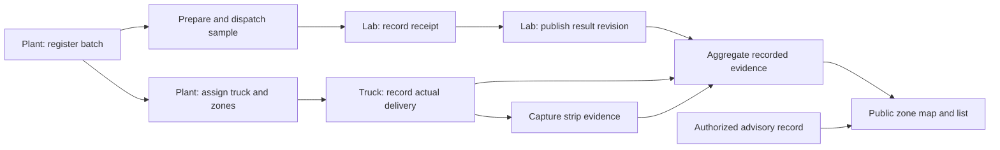

# RemoteWater: screen flows for review

Review the public Overview first (2 minutes). These are proposed screens, not implemented behavior. IDs, zone names and results below are fictional examples.

## 1. Public Overview

```text
RemoteWater                 Overview   Work   Language

Water quality by zone
[ Find a zone                                  ]
Updated 26 Sep, 10:42                 [Map | List]

┌──────────────────────────────────────────────────┐
│                                                  │
│       Labeled delivery zones on village map      │
│       ! North    ◷ Central    ✓ South    ? East   │
│                                                  │
└──────────────────────────────────────────────────┘
! Needs attention       ◷ Awaiting results
✓ Results within limits ? No current data

Select a zone to see delivered batches and results.
About · Demo
```

An active official advisory appears above the map with its approved instruction, scope, source and update time. Otherwise omit that section. In demo mode show one visible “Demo data” label. “Updated” is a real sync time, not a simulated clock.

Within advisory details or the footer, include “Village notices on Facebook” linking to the verified Page. Essential instructions stay on this screen; no embedded social feed or Facebook sign-in is required to read them.

Selecting North reveals this below the map on mobile and alongside it on desktop:

```text
North                                    [Close]
! Needs attention
1 delivered batch has a flagged lab result.

Delivered batches
[B-024 · flagged result · delivered 09:20       >]
[B-019 · awaiting results · delivered yesterday >]

Coverage: partial zone delivery recorded
Latest result published 26 Sep, 10:40
```

Selecting B-024 shows a compact lineage and highlights only its delivered zones:

```text
[Back to North]
Batch B-024
Plant → Sample S-024 → Lab result → Truck W1 → North

Lab: flagged result · published 26 Sep, 10:40
Field strip: uploaded · captured 26 Sep, 09:18
Delivery: North · 26 Sep, 09:20 · partial coverage

[Result details]
```

Keep exact measurements and units in Result details; keep an adverse result and active advisory visible immediately. No public phone numbers, raw driver images or staff information. A delivery to a zone does not prove the contents of every dwelling tank.

## 2. Treatment plant

```text
Work / Treatment plant
[Register batch]                         primary

Needs your action
B-024   Sample prepared   [Record dispatch]
B-023   Result published  [Assign delivery]

[All batches]                            secondary
```

```text
Register batch                          Step 1 of 2
Plant / loading point    [prefilled             ]
Batch time               [editable current time]
Volume, if known         [                     ]
[Register batch]

✓ Batch B-024 saved
Next: prepare its sample.
[Prepare sample]
```

Sample preparation is a short checklist driven by the approved SOP. Keep sample ID and batch ID in the header. Required facts: collection point/time/person, requested tests, receiving lab. Additional SOP fields use progressive disclosure when applicable. Record dispatch is a separate action after physical handoff; receipt belongs to Lab.

After dispatch, batch detail offers Assign delivery: truck, destination zone(s), eligibility state and Save assignment. Assignment alone does not recolor the public delivered-water map.

## 3. Water lab

```text
Work / Water lab
Samples awaiting results
[S-024 · B-024 · received 09:05 · Enter results >]
[S-023 · B-023 · received yesterday            >]

[Find sample]                            secondary
```

```text
Sample S-024 · Batch B-024               Step 1 of 2
Plant / collection time / sample condition

Test                     [requested parameter  ]
Result                   [value or qualitative ]
Unit                     [method-specific unit ]
Tested at                [                     ]
Report                   [Attach or reference  ]
[Review results]                         primary
Save draft                              secondary
```

Review shows the exact batch/sample and all entered results. Publish creates an audit revision and a durable confirmation. A failed upload retains the draft. Invalid sample condition records a rejection and prompts resampling; it is not a failed water test. Corrections require a reason and preserve the previous revision.

## 4. Truck

```text
Work / Truck W1                      Offline

Current assignment
Batch B-024 → North
Collection confirmed 08:50

[Record delivery]                        primary
Assignment details                      secondary
```

```text
North · Batch B-024                      Step 1 of 2
Delivery time            [09:20                ]
Coverage                 [Selected stops       ]
Quantity, if known       [                     ]
[Continue to strip test]

North · Batch B-024                      Step 2 of 2
[Take or choose photo]
Photo preview                           [Retake]
Sample time / point      [prefilled / confirm  ]
Strip type               [                     ]
Reading + unit           [                     ]
                        [Reading is unreadable]
[Save delivery]
```

Completion: “Delivery saved on this device. Photo waiting to upload.” Show “Synced” only after server acknowledgment. If required evidence is missing, save a clearly incomplete draft and expose the next step. Provide one specific recovery action, such as Retry upload or Retake photo.

## 5. Traceability and state flow



Sample, result and delivery states evolve independently:

| Track | States |
|---|---|
| Sample | Draft → Collected → Dispatched → Received; Rejected is a separate exception |
| Result | Not entered → Draft/Partial → Published → Superseded |
| Assignment | Assigned → Collected → Partially delivered → Completed; Hold/Cancelled are explicit exceptions |
| Evidence sync | Saved locally → Uploading → Acknowledged; Retry/Conflict preserve local work |
| Public quality | Needs attention / Awaiting results / Results within limits / No current data, plus independent advisory |

Use separate evidence and advisory tracks so a laboratory pass cannot silently erase an official advisory.

## 6. Share an approved notice

This task belongs to the authorized plant/notice workspace. A Page administrator may publish approved content without having authority to issue or lift advisories.

```text
Share notice A-014 · Revision 2 · North zone
Approved by [authority] · Issued [local date/time]

Channel: [Facebook]  SMS  Radio  Household contact
Destination: [Verified village Page name]

[Approved, reviewed post text]
Affected area · Required action · Issue time
Authority · Next update · Public notice link

[Copy post]                              primary
Open village Page                        secondary

Publication: Ready — not yet published
```

After manual posting, the administrator enters the post URL and publication time, then selects **Record publication**. Confirmation: “Published — resident reach unknown.” Household contact tasks remain open until their own outcomes are recorded.

Offline: “Draft saved — waiting for connectivity,” with a direct route to radio scripts and household contacts. When the notice changes, show “New revision — update this channel” and regenerate from the current approved text before publication. See [the notice-channel plan](outage-notifications.md#4-facebook-workflow).
